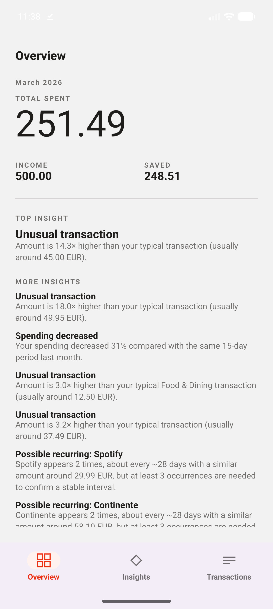
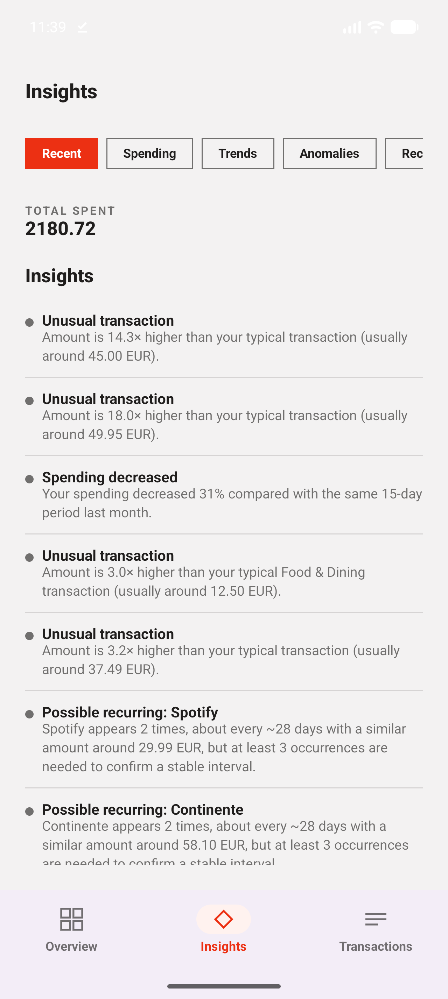
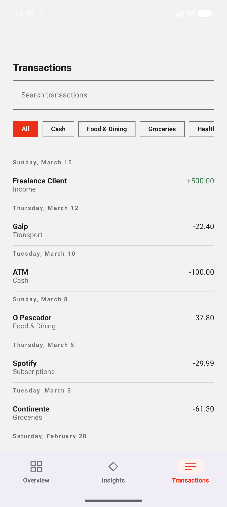

# Finance Analytics

<p align="center">
  
  
  
</p>

## What

Finance Analytics is a personal analytics platform for understanding
financial behaviour through data. A user imports a CSV export of their bank
transactions and gets spending trends, unusual-transaction detection,
recurring-subscription detection and evidence-backed insights — entirely
processed and stored on-device.

## Why

People already have access to their raw transactions; they lack meaningful
analysis of them. This project is not a budgeting app, an accounting system
or a banking app — it's a decision-support tool that turns a CSV export into
a small number of explainable insights, and a portfolio project demonstrating
Android engineering and applied data science together, end to end.

## Architecture

```text
Android (Kotlin, Compose, MVVM)
        │  HTTP / JSON
        ▼
FastAPI (transport + orchestration only)
        │
        ▼
Python Analytics Engine
   ├── Enrichment (merchant normalisation + categorisation)
   ├── Anomaly Detection
   ├── Recurring-Transaction Detection
   └── Insights Engine
```

The Android app owns local persistence (Room) and is local-first: CSV
import, storage and transaction browsing work with no network at all. It
sends its local transactions to the Analytics API for spending trends,
anomaly detection, recurring-payment detection and structured insights, and
degrades gracefully (an explicit "unavailable" state, not a crash) when that
API can't be reached. See `android/README.md`.

The API (`analytics/src/finance_analytics/api/`) is a thin, stateless
FastAPI layer: it validates the request, calls the analytics engine, and
maps the result onto a typed response — it contains no Pandas or ML code
itself. See `analytics/README.md` for the full endpoint/contract reference
and local-development instructions.

## Analytics

Built up sprint by sprint, each stage consuming the last (see
`analytics/README.md` for full method write-ups and `analytics/notebooks/`
for the reasoning behind every choice):

- **EDA** (`notebooks/02_exploratory_data_analysis.ipynb`) — establishes what
  the transaction data actually shows (temporal, category, merchant,
  distribution, outlier and recurring-candidate behaviour) before any
  detector is built, and documents this project's own dataset's limitations.
- **Anomaly detection** (`finance_analytics/anomalies/`) — a hierarchical,
  historical robust z-score (merchant → category → global baseline, never a
  transaction's own future data), chosen over `IsolationForest` because the
  available fixture is too small to train or validate a model against.
- **Recurring-transaction detection** (`finance_analytics/recurring/`) — a
  deterministic classifier combining interval consistency, amount
  consistency, occurrence count and history length into a confidence score,
  with an explicit 3-occurrence floor before anything is called "Recurring".
- **Merchant normalisation & categorisation** (`finance_analytics/enrichment/`)
  — a deterministic priority chain (known merchant → known description →
  existing trusted category → fallback), never fuzzy matching without
  observed evidence.
- **Insights Engine** (`finance_analytics/insights/`) — combines all of the
  above with period-comparison rules (spending trend, category change,
  income/expense divergence, savings-rate change) into structured, ranked,
  deduplicated `Insight` objects, using only comparable time windows.

None of this is ML or LLM-based. Every threshold is a documented,
evidence-motivated choice, not one fitted against labelled outcomes — no
labelled dataset exists for this product. Confidence and severity are
heuristics that communicate evidence strength, never a claim of fraud,
financial danger or advice.

## Running

Requires [uv](https://docs.astral.sh/uv/) and Android Studio (or the
command-line Android SDK).

**1. Python analytics — tests and notebooks**

```bash
cd analytics
uv sync
uv run pytest
uv run jupyter execute --inplace notebooks/02_exploratory_data_analysis.ipynb
# ...same for 03/04/05/06, or open them in `uv run jupyter lab`
```

**2. The API**

```bash
cd analytics
uv run uvicorn finance_analytics.api.app:app --reload
```

Interactive docs: <http://127.0.0.1:8000/docs>. See `analytics/README.md`
for example requests and the full error-response reference.

**3. Android**

```bash
cd android
./gradlew assembleDebug
```

Or open `android/` in Android Studio and run on an emulator/device. The app
defaults to reaching the API at `10.0.2.2:8000` (the emulator's alias for
the host machine) — see `android/README.md` for pointing it at a physical
device instead.

**4. Tests**

```bash
cd analytics && uv run pytest                       # 247 tests
cd android && ./gradlew test                        # JVM unit tests
cd android && ./gradlew connectedAndroidTest         # instrumented/Compose tests, needs a device/emulator
```

## Engineering decisions

- **Local-first Android.** Room is the single source of truth for
  transactions; the Analytics API is called explicitly (not on every
  recomposition) and its unavailability never blocks browsing local data —
  only the API-backed insights sections show an explicit unavailable/retry
  state.
- **A dedicated Python analytics environment (`analytics/`), independent of
  Android.** No shared code or runtime integration; the only contract
  between them is the HTTP/JSON API.
- **FastAPI as a transport boundary only.** `api/service.py` is the one
  place that talks to both Pydantic and Pandas; no anomaly threshold,
  recurring threshold, feature-engineering step or insight rule lives in a
  route handler. The OpenAPI contract it generates is the source of truth
  the Android DTOs are verified against — not the other way around.
- **Deterministic analytics before ML.** Every detector in this project
  evaluated and explicitly rejected an ML approach given how small the
  available fixture is, and documented that reasoning rather than reaching
  for `scikit-learn` by default.
- **Explainable insights.** Every anomaly, recurring candidate and insight
  carries a deterministic, template-based explanation referencing the
  specific evidence behind it — no LLM anywhere in the pipeline.

## Privacy

- Nothing sent to the API is persisted, logged, or retained between
  requests — it's stateless by construction, not by convention.
- Neither the Android app nor the API logs transaction payloads, analytics
  responses, merchant names or amounts (verified as part of this project's
  final validation pass — see below).
- No real financial data, private datasets or credentials are committed;
  the only tracked fixture is a synthetic CSV built for this project (see
  `analytics/data/README.md`).
- Local development only: no authentication or transport security is
  implemented. Do not point this app at a real financial export or expose
  the API outside a trusted local environment.

## Future work

Genuine remaining improvements, not implemented here:

- Authentication and a real deployment (the API is local-development only).
- Currency/locale-aware amount formatting (Settings is still a design-only
  placeholder in the approved scope).
- A shared, app-level analytics cache — Overview and Insights currently
  each trigger their own `POST /analytics/analyse` request for the same
  local transactions.
- Linking a recurring-payment result back to individual transactions in the
  Transaction Detail sheet (today `RecurringTransaction` is a
  merchant/currency-level result, not keyed by transaction id).
- Stronger method evaluation once a larger, labelled dataset exists —
  every current threshold is evidence-motivated, not statistically fitted.
- Category Analytics and Settings screens described in the design system
  but outside this project's approved MVP scope.

## Structure

- `android/` — Android application (Kotlin, Jetpack Compose, MVVM)
- `analytics/` — Python analytics engine, notebooks and the FastAPI service
- `docs/` — engineering and project documentation
- `assets/` — branding and screenshots

## License

MIT — see [LICENSE](LICENSE).
